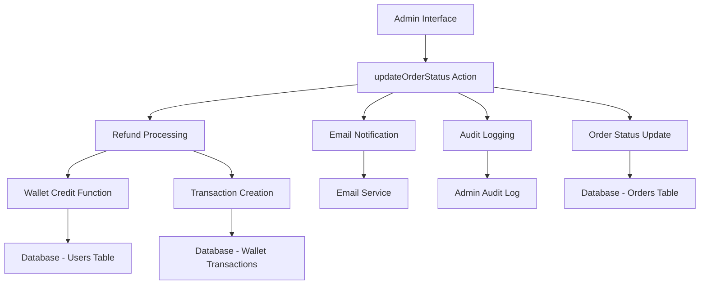

# Design Document: Order Failure Refund System

## Overview

This design implements an automatic wallet refund and notification system that triggers when an admin marks an order as "failed". The system ensures data consistency through atomic transactions, provides comprehensive audit logging, and notifies users via email about the refund.

The solution extends the existing `updateOrderStatus` function in `app/admin/orders/actions.ts` to handle the "failed" status case, leveraging existing database functions and email infrastructure.

## Architecture

The system follows a layered architecture pattern:



## Components and Interfaces

### 1. Order Status Handler (Enhanced)

**Location**: `app/admin/orders/actions.ts`

The existing `updateOrderStatus` function will be enhanced to handle the "failed" status:

```typescript
interface OrderFailureHandler {
  processFailedOrder(orderId: string, adminNotes: string, currentUser: User): Promise<void>
  validateRefundEligibility(order: Order): boolean
  revertOrderStatus(orderId: string, originalStatus: string, errorMessage: string): Promise<void>
}
```

### 2. Wallet Refund Service

**Location**: New utility in `lib/wallet/refund-service.ts`

```typescript
interface WalletRefundService {
  processOrderRefund(order: Order, adminUserId: string): Promise<RefundResult>
  validateRefundAmount(amount: number): boolean
  checkDuplicateRefund(orderId: string): Promise<boolean>
}

interface RefundResult {
  success: boolean
  transactionId?: string
  newBalance?: number
  error?: string
}
```

### 3. Enhanced Email Templates

**Location**: `lib/email/order-notifications.ts`

The existing email system will be enhanced with improved "failed" order templates:

```typescript
interface FailedOrderEmailData extends OrderEmailData {
  refundAmount: number
  refundMethod: 'wallet' | 'bank_transfer'
  estimatedRefundTime: string
}
```

### 4. Database Functions

**Location**: Existing `database/functions/credit_wallet.sql`

The existing `credit_wallet` function will be used with enhanced error handling and validation.

## Data Models

### Enhanced Order Model

The existing order model supports all required fields:

```typescript
interface Order {
  id: string
  user_id: string
  total_price: number
  status: 'awaiting_payment' | 'pending' | 'completed' | 'failed' | 'awaiting_refund' | 'refunded'
  payment_method: 'wallet' | 'bank_transfer'
  // ... other existing fields
}
```

### Wallet Transaction Model

The existing wallet transaction model supports refund transactions:

```typescript
interface WalletTransaction {
  id: string
  user_id: string
  transaction_type: 'credit' | 'debit' | 'refund'
  amount: number
  balance_before: number
  balance_after: number
  description: string
  order_id?: string
  created_by?: string
  reference?: string
  created_at: string
}
```

## Implementation Details

### 1. Failed Order Processing Logic

```typescript
async function processFailedOrder(orderId: string, adminNotes: string, currentUser: User) {
  const transaction = await supabase.transaction()
  
  try {
    // 1. Get order details with user info
    const order = await getOrderWithUserDetails(orderId)
    
    // 2. Validate refund eligibility
    if (!validateRefundEligibility(order)) {
      throw new Error('Order not eligible for refund')
    }
    
    // 3. Check for duplicate refund
    const isDuplicate = await checkDuplicateRefund(orderId)
    if (isDuplicate) {
      throw new Error('Order already refunded')
    }
    
    // 4. Update order status
    await updateOrderStatusInDB(orderId, 'failed', adminNotes)
    
    // 5. Process wallet refund (if amount > 0)
    if (order.total_price > 0) {
      await processWalletRefund(order, currentUser.id)
    }
    
    // 6. Send email notification
    await sendFailedOrderNotification(order, adminNotes)
    
    // 7. Log admin action
    await logAdminAction({
      action: 'ORDER_FAILED_WITH_REFUND',
      entityType: 'order',
      entityId: orderId,
      oldValues: { status: order.status },
      newValues: { status: 'failed', refund_amount: order.total_price }
    })
    
    await transaction.commit()
    
  } catch (error) {
    await transaction.rollback()
    
    // Revert order status if it was changed
    await revertOrderStatus(orderId, order.status, error.message)
    
    throw error
  }
}
```

### 2. Wallet Refund Processing

```typescript
async function processWalletRefund(order: Order, adminUserId: string): Promise<RefundResult> {
  try {
    // Use existing credit_wallet function with refund-specific parameters
    const result = await supabase.rpc('credit_wallet', {
      p_user_id: order.user_id,
      p_amount: order.total_price,
      p_description: `Refund for failed order ${order.id.slice(0, 8)}`,
      p_order_id: order.id,
      p_reference: `refund_${order.id}`,
      p_created_by: adminUserId
    })
    
    // Update transaction type to 'refund' for proper categorization
    await supabase
      .from('wallet_transactions')
      .update({ transaction_type: 'refund' })
      .eq('order_id', order.id)
      .eq('user_id', order.user_id)
      .eq('reference', `refund_${order.id}`)
    
    return {
      success: true,
      newBalance: result,
      transactionId: `refund_${order.id}`
    }
    
  } catch (error) {
    return {
      success: false,
      error: error.message
    }
  }
}
```

### 3. Enhanced Email Template

The failed order email template will include:

- Clear indication of order failure
- Refund amount and method
- Estimated refund timeline
- Admin notes (if provided)
- Links to wallet/dashboard
- Support contact information

```typescript
function getFailedOrderEmailTemplate(orderData: FailedOrderEmailData): EmailTemplate {
  return {
    subject: `Order Refunded - ${orderData.orderId} | BAO OLAKING`,
    html: generateFailedOrderHTML(orderData)
  }
}
```

## Correctness Properties

*A property is a characteristic or behavior that should hold true across all valid executions of a system-essentially, a formal statement about what the system should do. Properties serve as the bridge between human-readable specifications and machine-verifiable correctness guarantees.*

Now I'll analyze the acceptance criteria to determine which ones are testable as properties:

### Property Reflection

After analyzing all acceptance criteria, several properties were identified as redundant:
- Properties about transaction type and order linking appear multiple times
- Error handling properties are duplicated across different requirements
- Refund amount validation appears in multiple contexts

The following consolidated properties eliminate redundancy while maintaining comprehensive coverage:

### Correctness Properties

**Property 1: Wallet Credit Amount Accuracy**
*For any* order marked as "failed", the wallet credit amount should equal the order's exact total_price
**Validates: Requirements 1.1, 6.1**

**Property 2: Refund Transaction Creation**
*For any* failed order refund, a wallet transaction record should be created with transaction_type "refund" and linked to the original order via order_id
**Validates: Requirements 1.2, 1.3, 2.1, 2.5**

**Property 3: Transaction Balance Consistency**
*For any* refund transaction, the balance_after should equal balance_before plus the refund amount
**Validates: Requirements 2.2**

**Property 4: Transaction Audit Trail**
*For any* refund transaction, the description should reference the failed order ID and created_by should match the admin who initiated the status change
**Validates: Requirements 2.3, 2.4**

**Property 5: Error Recovery Atomicity**
*For any* failed wallet refund operation, the order status should be reverted to its previous value and all database changes should be rolled back
**Validates: Requirements 1.4, 5.1, 5.2, 5.5**

**Property 6: Payment Method Independence**
*For any* order marked as "failed", the wallet refund should be processed regardless of the original payment method (wallet or bank_transfer)
**Validates: Requirements 1.5, 6.4**

**Property 7: Email Notification Delivery**
*For any* order marked as "failed", an email notification should be sent to the customer containing order details and refund information
**Validates: Requirements 3.1, 3.2, 3.4**

**Property 8: Admin Notes Inclusion**
*For any* failed order with admin notes provided, both the email notification and audit log should include those notes
**Validates: Requirements 3.3, 4.5**

**Property 9: Email Failure Resilience**
*For any* email sending failure during order failure processing, the refund operation should continue and the email error should be logged
**Validates: Requirements 3.5, 5.4**

**Property 10: Admin Action Logging**
*For any* order marked as "failed", an audit log entry should be created with the admin action, old/new status values, and refund details
**Validates: Requirements 4.1, 4.2, 4.3**

**Property 11: Error Logging Completeness**
*For any* refund operation failure, the error reason and details should be logged in the audit system
**Validates: Requirements 4.4**

**Property 12: Duplicate Refund Prevention**
*For any* order that has already been refunded, subsequent refund attempts should be prevented
**Validates: Requirements 6.3**

**Property 13: Large Refund Handling**
*For any* refund amount exceeding system limits, a warning should be logged but the refund should still be processed
**Validates: Requirements 6.5**

## Error Handling

### Transaction Rollback Strategy

The system implements a comprehensive rollback strategy:

1. **Database Transaction Scope**: All order status updates, wallet operations, and transaction records are wrapped in a single database transaction
2. **Compensation Actions**: If wallet operations fail after order status update, the order status is explicitly reverted
3. **Error Propagation**: Failures are propagated to the admin interface with clear error messages
4. **Audit Trail**: All failures are logged with detailed error information

### Failure Scenarios

1. **Wallet Credit Failure**: Revert order status, log error, notify admin
2. **Transaction Record Failure**: Rollback wallet balance, revert order status
3. **Email Failure**: Continue processing, log email error, complete refund
4. **Audit Log Failure**: Continue processing, log audit failure separately

## Testing Strategy

### Dual Testing Approach

The system will be validated using both unit tests and property-based tests:

**Unit Tests** will cover:
- Specific error scenarios and edge cases
- Integration points between components
- Email template rendering and content validation
- Database function behavior with known inputs

**Property-Based Tests** will cover:
- Universal properties across all order types and amounts
- Comprehensive input coverage through randomization
- Transaction consistency across various failure scenarios
- Error handling behavior with random failure injection

### Property Test Configuration

- **Minimum 100 iterations** per property test due to randomization
- **Test Framework**: Jest with fast-check for property-based testing
- **Tag Format**: **Feature: order-failure-refund, Property {number}: {property_text}**
- Each property test references its corresponding design document property

### Test Data Generation

Property tests will generate:
- Random order amounts (including edge cases like 0, negative, very large)
- Various order statuses and payment methods
- Different admin user scenarios
- Simulated failure conditions for error handling tests

The testing strategy ensures comprehensive validation of both specific examples and universal correctness properties across all possible inputs and failure scenarios.